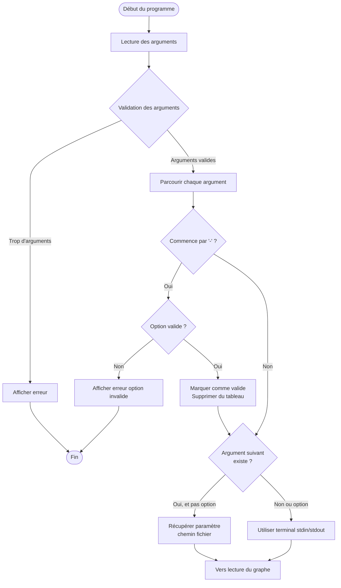
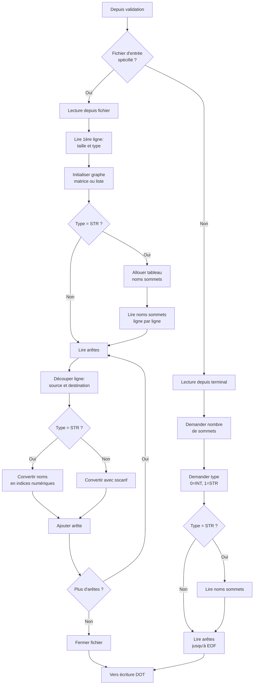
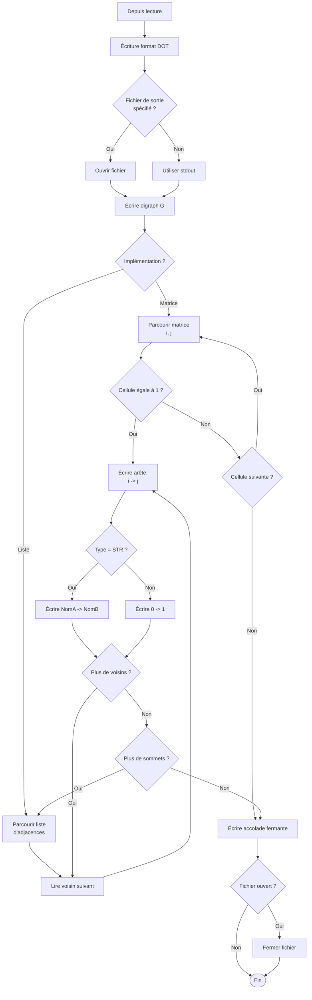

Exercice 1 : Conversion d’un graphe au format DOT

Ce programme est organisé de la façon suivante :
Lecture des arguments
Lecture du graphe dans un fichier ou la console
Ecriture dans un fichier DOT ou la console
Lecture des arguments

Pour valider les arguments on en distingue deux types :
les options (-i, -o, -start, -go)
les paramètres (la valeur associée à l’option)

Ces arguments ne pouvant exister qu’en nombre limité le programme affiche une erreur s’il en a trop (plus que 4 dans le 1, plus de 6 dans le 2…).

Les options valides sont stockées dans un tableau de façon à pouvoir les comparer aux options rentrées, et ce sont les options que l’on valide en premier :
Pour chaque argument :
on regarde si c’est une option (si option[0] == '-')
Si cette option existe dans le tableau alors elle est valide et on sait à quoi elle correspond et on la supprime dans le tableau pour éviter les doublons
Sinon on affiche le message d’erreur
sinon on la considère non valide (validité = 0)
Pour chaque argument on regarde sa validité
Si sa validité est non nulle et la validité de l’argument suivant oui (s’il existe) alors c’est un paramètre (chemin du fichier à lire par exemple)
Si la validité du sommet suivant n’est pas nulle c’est qu’il n’y a pas de fichier à lire ou dans lequel écrire, on utilisera le terminal
Lecture du graphe
 
Le programme prend en charge deux modes de lecture : depuis un fichier ou depuis le terminal (stdin).

Lecture depuis un fichier :

 Détection des caractéristiques : lecture de la première ligne du fichier pour déterminer
La taille du graphe (nombre de sommets)
Le type de sommets (INT pour des nombres, STR pour du texte)
Création de la structure : initialisation du graphe avec une matrice ou une liste
Allocation des sommets : Si le type est STR, on alloue un tableau de chaînes de caractères pour stocker les noms des sommets
Lecture ligne par ligne :
Saut de la première ligne (déjà lue plus haut)
Pour les graphes de type STR : lecture des noms des sommets (une ligne par sommet) et enregistrement dans le tableau
Lecture des arêtes :
Découpe de la ligne en deux (source et destination)
Si le type est STR : conversion en valeur numérique grâce à la table de correspondance (avec une fonction qui renvoie le nombre associé)
Sinon conversion directe en nombre avec sscanf
Ajout avec la fonction adéquate
Fermeture du fichier

Lecture depuis le terminal :

Si aucun fichier d'entrée n'est spécifié, le programme lit depuis stdin :

- Demande interactive du nombre de sommets
- Demande du type (0 pour INT, 1 pour STR)
- Lecture des noms des sommets si type STR
- Lecture des arêtes jusqu'à EOF (Ctrl+D sur Linux, Ctrl+Z sur Windows)
Écriture au format DOT

Ouverture : Si un fichier de sortie est sortie non nulle, on l'ouvre en écriture. Sinon, on écrit sur stdout.
En-tête DOT  : Ecriture de “digraph G {“ pour indiquer le début d'un graphe
Parcours du graphe :
Pour une matrice : Avec une boucle imbriquée, on parcourt la matrice d’adjacence, pour chaque case `[i][j]` égale à 1, on écrit `i -> j;` (ou avec les noms si type STR).
Pour une liste :
On parcourt la liste extérieure avec l’exemple donné dans le sujet.
Chaque maillon est une liste d'adjacences que l’on parcourt avec une boucle for et pour chaque voisin lu  on écrit l'arête correspondante.
Les arêtes sont formatées selon le type :
Type INT : “0 -> 1;”
 Type STR : “SommetA -> SommetB;”

4. On termine par `}` et on ferme le fichier (si besoin).

## Schéma de l'algorithme

### Partie 1 : Validation des arguments

### Partie 2 : Lecture du graphe

### Partie 3 : Écriture au format DOT

